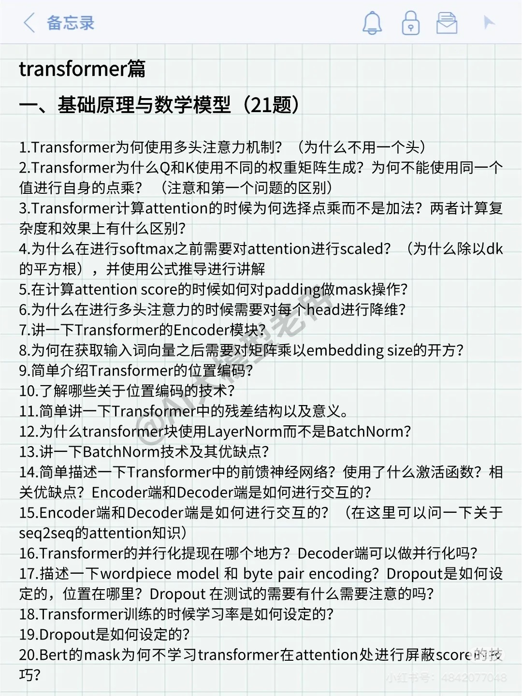

### 大模型面试1

本文大多数内容由chatGPT o3-mini生成（当然我们都知道它其实是Deepseek的r3模型），我对部分内容进行了修改，如果拿来学习一定要加入自己的思考。

---

**Q01：Transformer为什么使用多头注意力机制？为什么不只用一个头？**

多头注意力机制允许模型<u>在不同的子空间中同时捕捉输入序列中的多样化信息</u>。每个头可以关注不同的特征，这样能更全面地理解输入的语义和结构。若只使用一个注意力头，模型可能无法充分提取多种复杂的关系，因为<u>单个头的话，在处理某个词时，会将很多注意力分给自己，缺乏对其他有关联的词的关注</u>。此外，多头设计还<u>便于并行计算，提高了训练效率</u>。

> 比方说，在英语句子里，多头注意力可以搞清楚it指代的是什么。

**Q02：Transformer为什么Q和K使用不同的权重矩阵生成？为什么不能使用同一个值进行自身的点乘？**

Transformer中使用不同的权重矩阵生成Q和K，是<u>为了让模型在查询和匹配过程中能捕捉到不同的特征信息</u>。每个矩阵负责将输入映射到适合自己任务的表示空间，使得Q和K在计算注意力分数时能体现各自的特定含义。若<u>使用同一个权重矩阵</u>，则可能<u>会限制模型在捕捉复杂关系上的能力</u>。这样的设计提升了模型对不同语义和结构信息的区分与理解能力。而且，使用<u>相同值进行点乘会导致退化问题</u>，如果Q和K是相同的，还进行点乘，注意力计算就相当于每个输入项与自身进行比较，注意力权重会更多地倾向于自我相关，捕捉不了全局依赖关系。

> 1. 提高学习的灵活性，分别给查询和匹配学习到不同的特征。
> 2. 避免模型退化成只关注自相关，无法捕捉全局依赖。
> 3. 减少信息瓶颈，让模型提取更多上下文信息。

**Q03：Transformer计算attention的时候为什么选择点乘而不是加法？两者计算复杂度和效果上有什么区别？**

分几个方面来说，首先是<u>计算效率方面，点乘可以通过矩阵乘法一次性计算两个向量的相似度</u>，从而提高效率，而加法操作需要对向量每个分量分别计算。<u>表达能力方面，点乘可以捕捉Q向量和K向量的相似度，从而让模型关注与查询向量最相关的部分</u>，而加法会导致模型关注不太相关的信息。<u>计算复杂度方面</u>，点乘是O(n^2 * d)，n是序列长度，d是向量维度，加法则是O(n * d)。实际应用中，n通常比d大很多，因此<u>他们的计算复杂度差异不大</u>。

> Transformer选择点乘注意力因为计算效率高，可以用矩阵乘法并行优化，尤其适合大规模的训练和推理。
>
> 计算复杂度上虽然理论上加法乘法都是O(d)，但点乘在实际硬件中通过并行能显著提升速度。

**Q04：为什么在进行softmax之前要对attention进行scaled（为什么除以dk的平方根）？**

对attention的点积结果进行缩放，是为了<u>防止因维度过大导致数值过大，使softmax函数输出过于极端</u>。除以dk的平方根可以使得点积的数值保持在较为适中的范围内，从而<u>避免梯度消失或梯度爆炸</u>。这种缩放方式帮助模型在训练过程中更稳定，提升学习效率。

> 从公式看来，Q和K进行点乘的结果尺寸是嵌入维度乘以嵌入维度，而Transformer的嵌入维度是512。数量级对softmax的分布影响很大，在数量级较大的时候，softmax将几乎全部概率分给了最大值对应的标签。
>
> 除以dk的平方根就像是一种smoothing，假设本来是【1，2，8，2，16】的数据，dk的平方根是8，就变成了【0.125，0.25，1，0.25，2】，他们的方差一下就小了很多。
>
> 那么有别的方法不用除以根号dk吗？有的，比如使用更好的初始化，类似于google的T5模型，在初始化阶段就解决了这个问题。
>
> [参考连接](https://blog.csdn.net/ytusdc/article/details/121622205#:~:text=ytusdc-,%E4%B8%BA%E4%BB%80%E4%B9%88%E5%9C%A8%E8%BF%9B%E8%A1%8Csoftmax%E4%B9%8B%E5%89%8D%E9%9C%80%E8%A6%81%E5%AF%B9attention%E8%BF%9B%E8%A1%8Cscaled,%E4%BB%A5d_k%E7%9A%84%E5%B9%B3%E6%96%B9%E6%A0%B9%EF%BC%89%20%E5%8E%9F%E5%88%9B&text=%E8%A7%A3%E9%87%8A1%EF%BC%9A,%E7%A1%AC%E7%9A%84%EF%BC%88hard%EF%BC%89softmax%E3%80%82)