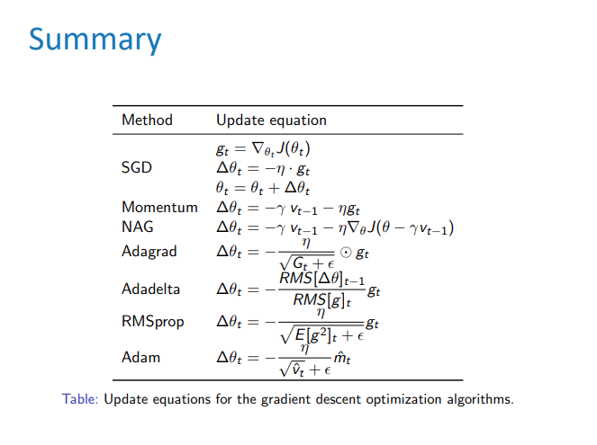
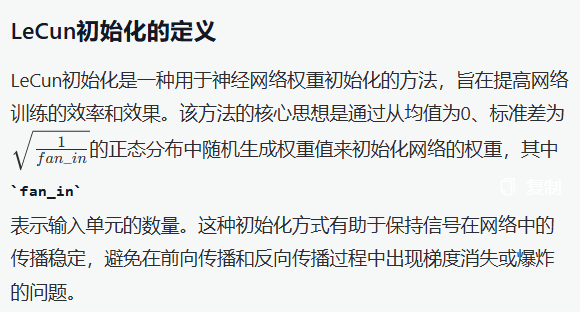
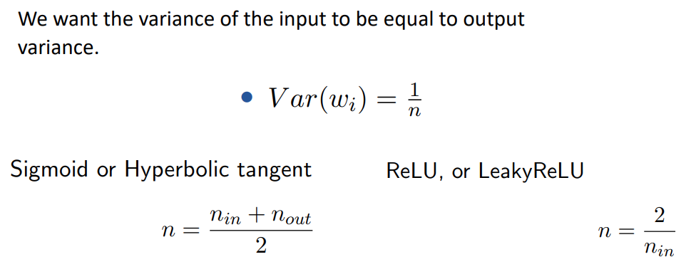

## 为什么要用深度学习？

1. 手动设计features经常会过于具体，不够完善，并且要很长的时间去设计和验证。
2. 每个任务或领域都要重新设计。
3. 但是被学到的features都很容易适应，模型学习起来很快。
4. 深度学习提供了非常灵活，可被学习的框架来representing the world（视觉或语言上的某些潜在信息）。
5. 深度学习不但能无监督学习，还可以监督学习。

## 反向传播

反向传播是深度学习中一种核心的优化算法，主要用于训练神经网络。其主要功能是通过计算损失函数相对于网络参数（如权重和偏置）的梯度，来更新这些参数，从而最小化损失函数，提高模型的预测准确性。

1. **高效计算梯度**：反向传播利用链式法则，从输出层逐层向输入层计算每个参数的梯度。这种方法避免了手动计算每个参数的导数，极大地提高了计算效率。
2. **优化模型性能**：通过反向传播，神经网络能够根据预测误差调整权重，使得模型能够更好地适应训练数据，从而提高预测准确性。

3. **解决复杂问题**：反向传播能够处理复杂的非线性问题，广泛应用于图像识别、自然语言处理等领域。
4. **自动微分**：反向传播算法利用自动微分的原理，使得神经网络能够在多层结构中有效学习。

反向传播的核心思想是通过计算损失函数的梯度，指导权重的更新，从而实现模型的优化。

## SGD变体

### SGD with Momentum

- **reduces updates** for dimensions whose gradients **change directions**.
- **Increases updates** for dimensions whose gradients **point in the same directions**.

### Adagrad

Adagrad根据参数调整学习率，相当于自适应的学习率 (不频繁的参数加大更新，频繁的参数减小更新)。Adagrad让学习率除以以往斜率的平方的和的开方。

优点：

- 应对稀疏数据比较好用（数据框中很多数据缺失或为0）
- 极大地提高SGD的鲁棒性
- 减少了手动调整学习率的需求

缺点：

- 在分母中累计过往斜率的平方（导致学习率无限缩小）

### Adadelta

类似上面的Adagrad，但是累计过往的斜率的窗口会被限制成一个固定大小的窗口。比如，一个大小为3的窗口，里面永远只存过往的3个斜率，新的来了就把旧的去掉。

### RMSProp

Root Mean Squared error of gradient. 其实上面的Adadelta用的也是这个方法，两者在逻辑上很像但不完全相同。

### Adam

Adaptive Moment Estimation. 它同样储存过往的斜率的平方的平均，和上面两个一样。它也像Momentum，储存过往的斜率的平均值。

### 如何选用optimizer？

- Adaptive learning rate的方法（Adagrad，Adadelta，RMSprop，Adam）对于特征稀疏的数据来说非常好用。
- Adagrad，Adadelta，RMSprop，Adam在相似的情形中好用。
- Adam有个技术点叫bias-correction让其稍微强于RMSprop。

## Regularization

DNN会过拟合，使用regularization解决。

### Dropout

简单好用。在训练中随机关闭一些神经元的更新，推断时则全打开。

### Batch Normalization

批归一化，可以加速训练并提高性能。简单来说，它规范化输入数据，加速了模型收敛。减少了不同批次数据之间的差异，让模型训练更加稳定，降低了对初始权重和学习率的敏感性。

更多关于批归一化的内容可以参考[这篇博客](https://www.cnblogs.com/skyfsm/p/8453498.html)

### 梯度爆炸

很常见的问题，这里提到一个解决办法叫Gradient clipping。

Gradient Clipping，如果梯度的norm比一个阈值大，则在SGD更新之前进行Scaling缩小。

直观来说，就是在同一个方向走一步，但是是更小的的一步。

## Initialization

好的初始化可以加速训练，同时，把权重初始化到小的随机值是很重要的。

### LeCun初始化

### Xavier & He Initialization

