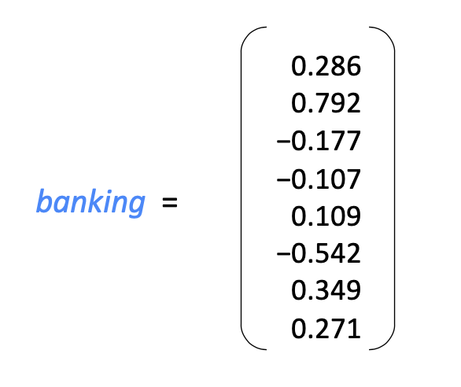
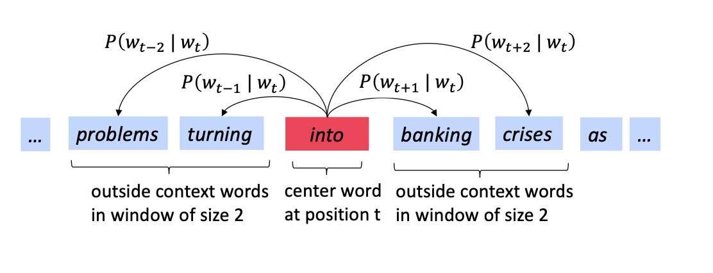

## Word vectors

这篇笔记建议结合[本节课件](Lecture-4.pdf)一起学习，后半部分很多笔记没有配图片。

前半部分的笔记是关于训练一个词嵌入模型，因为传统的词嵌入模型比如bow和ngram都没有考虑到词义，所以需要一个更具理解能力的方法。

### Word meaning + distributed representations

分布式表示什么意思，什么作用？

> 后面会发现其实就是让词变成词嵌入，分布在一个空间里（？）

#### LM for word vector

### Word meaning

简而言之，词是可以代表某些想法和思想的，那么怎么用计算机来理解并运用这些关系呢？

常见的解决办法是`WordNet`，一个包含了同义词的同类词汇编。但它也有一些问题，比如`proficient熟练的`被写作`good好的`的同义词，但这仅在少数上下文情况下合理。而且有很多词诞生了新的意思，`wordnet`并没有更新他们新的意思，比如`wicked`，`badass`，而且保持最新状态是不可能的。除此之外，它还具有主观性，且需要人力去维护。

另一个办法是使用discrete symbols。比方说：

- motel = [000001000] hotel = [000000010]

像这样的one-hot在词多的情况下 vector dimension会非常大，而且无法计算两个词的相似度。如果要使用`wordnet`来计算相似度，就又要面临不完整的问题。而且多义词该怎么表示？

### Word vectors

因此我们使用word vectors，比如一个`banking`这个词，有一个vector并且里面有八个元素。这种方法其实就是我们说的词嵌入或者词表示。

LM也是在做同样的事情，举个例子，一个LM被输入了一系列的词（嵌入），然后输出一个词（嵌入）。这很合理，因为我们通常不能让LM直接吐出单词或汉字来。

## Word2Vec model + negative sampling

让词向量们自己学习编码相似度。

Distributional semantics 分布式语义，一个词的意思由经常出现在它旁边的词给予的。

> 个人认为这里其实是在突出context上下文的作用

当一个词w出现在文本中，它的上下文（内容）是它附近的一组词，就像一个固定大小的窗口。然后我们用很多的词w的上下文来构造w的representation。下面是一个banking的例子。

> 我认为这个representation其实就是词w的word vector。

### Word2Vec

创造词嵌入的基本想法是这些：

- 有个大的文本语料库
- 每个词由一个vector代表
- 通过每条文本里的每个位置 有一个中心词c和很多语境词o
- 通过c和o的词向量的相似度 来计算在c出现的情况下 o出现的概率（以及反过来）
- 调整词向量来使得概率最大化

#### CBOW

Continuous Bag of Words架构，连续词袋。

简单来说，如果我们的目标是学习词嵌入，我们可以不仅仅输入那些 在目标词c前面的词o们，还可以输入在目标词c后面的词o们。

像是一个网络，输入前面的outside words和后面的outside words，然后输出target word。

#### Skipgram

和前面相反，训练一个网络，输入target word，然后输出它前面和后面的outside words。

这个也是看window大小的，简单来说也是计算概率，也就是基于目标词为条件的情况下，前面和后面的词为什么词的概率更大。

#### Prediction

使用了softmax函数，max是指最大的x的概率会被增幅，soft是指即使再小的x也会被分配一些概率。softmax里面的z是outside word和center word的相似度，计算方法其实就是他们两个的dot product。

然后就是loss和gradient的计算。Ground truth会是一个独热编码，然后模型计算出来的会是每个词的概率做成一个向量，两个相减得到的就是他们的error误差。

训练方面就是把error拿给模型去更新权重。

一次次epoch之后，这个训练好的模型就是我们的embedding matrix了，我们可以拿它去给其他应用来使用。

这里有一个问题，就是softmax的计算成本很高，所以我们转换一下task。原来的做法是，直接预测某个词的邻居是哪个词，我们使用的是softmax。现在转换成，输入两个词，判断他们两个是不是邻居，我们用sigmoid，会直接输出一个概率。

这样就变成了一个逻辑回归模型，简单多了，计算快多了。

### Negative Sampling

上面的方法很好，但存在一个问题，就是没有负面样本。简而言之，如果两个词本身就不连着，那么模型学习不到这个，模型只知道哪些词连着，却不知道哪些词不连着。因此，我们需要引入负面样本，做法就是随机在词库中采样。

> 如果不加入负面样本，那么模型在训练中只见过连着的，测试中也只会被考连着的，它只要一直输出“相连”就可以达到满准确率。因为它不知道不连着的情况是什么样的，它没被训练过这样的例子，也没被测试过这样的例子。

#### Skipgram + Negative sampling

别忘了skipgram是给一个target word去预测outside word，因此我们让模型最大化真实outside word出现的概率，最小化无关词出现在center word附近的概率。

#### skipgram training

随机初始化一个Embedding矩阵和一个Context矩阵。他们的尺寸均为词数量✖️embedding大小（上面提到banking的例子是8，transformer的例子是512）

每个训练步中，确定一个center word，取一个它真正的outside word，以及几个它的outside word。然后分别计算center word对这里每一个词的sigmoid，并用target和sigmoid结果相减，分别得到他们的error，然后对模型参数进行更新。

我们一般可以修改两个超参数，一个window的尺寸，另一个是负面样本的数量。

## Evaluating word vector

如何评估你这个word vector的embedding模型是不是一个好模型？

分为内在评估和外在评估。内在的评估就是直接在实际task中评估，但不确定是否真的对末端有帮助。外在评估就是在实际应用中评估，但不能确定是子系统的问题还是与其互动的问题还是其他问题。

### Intrinsic evaluation

举个例子：king - man + woman = queen

另一个例子：tokyo - japan + france = paris

总结一下就是要找相似度，似乎是余弦相似度。

Vector arithmetic = similarity arithmetic

### Extrinsic evaluation

更直接的任务：被命名的实体识别（人，城市，机构），parsing（区分句子中每个词是什么部分，什么类型）

末端任务：机器翻译，语义分析，文章总结，对话系统。这些是就是NLP常见任务了。

## Cross-lingual word embeddings

简单来说，NLP不仅仅可以用于英语，还可以用于很多其他语言。

我们可以把不同的语种放入一个embedding space中，这么做的原因是：

- 比较不同语言的词意（双语词典归纳和机器翻译的关键）

- 不同语言之间知识传递的关键（Cross-lingual NER，QA，情感分析）

### Dealing with multiple senses

- 大多数词是多义词
  - 尤其是常见的词
  - 尤其是存在时间很长的词

那我们应该每个词义都有一个vector？还是一个vector代表所有词义？

> 个人感觉一个vector代表所有词义是可以做到的，embedding dimension可以增加，原本很远的距离可以在另一个dimension很近。

最近的一些研究或产品（ELMo，BERT）是每个词义一个vector。

