# Effective Transformer

这是[LLM课第五周](Effective_Transformer.pdf)的笔记，主要内容是关于如何优化一个2017年的原始Transformer。

从上往下，可以优化的地方有FFN层，多头Self-Attention层，LayerNorm方法，以及位置编码。

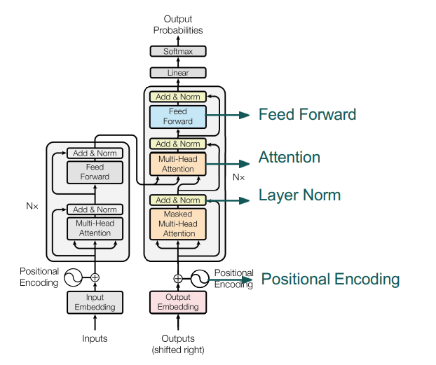

## FFN优化

### 激活和双线性层

原始的Transformer在FFN层用的是GELU（Gaussian Error Linear Unit），也是BERT和GPT用的激活函数。GELU是连续的可求导的函数，另外的这个switch激活函数也是。

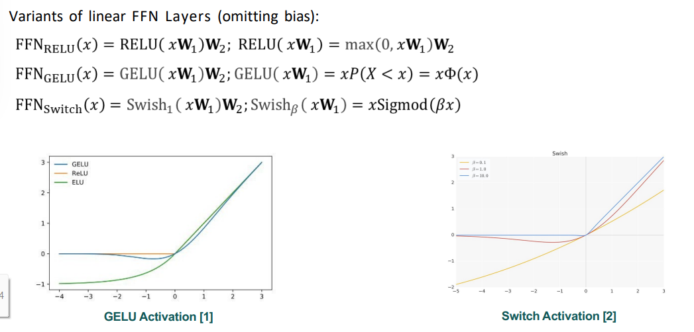

上面是一些别的激活函数，下面我们来看下双线性层是什么样的，还有他们的最终效果。文字第一行，普通双线性层就是两个FFN做componentwise product。第二行第三行也是两个FFN做componentwise product，但是其中一个FFN做RELU或GELU。第四行是使用swish activation，模型的形状是右边的图。

从下方的表格来看，使用双线性的同时，采用GELU或swish的效果是最好的，同时提升了速度和训练质量。

Perplexity是一个使用Google T5为base的大模型。

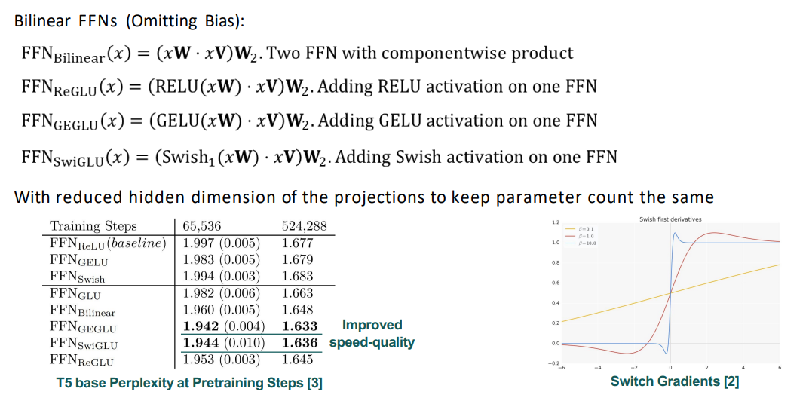

### Mixture of Experts

混合专家模型 (MoE) 的理念起源于 1991 年的论文 [Adaptive Mixture of Local Experts](https://www.cs.toronto.edu/~hinton/absps/jjnh91.pdf)。这个概念与集成学习方法相似，旨在为由多个单独网络组成的系统建立一个监管机制。在这种系统中，每个网络 (被称为“专家”) 处理训练样本的不同子集，专注于输入空间的特定区域，这段说明来自[Hugging face](https://huggingface.co/blog/zh/moe#%E4%BB%80%E4%B9%88%E6%98%AF%E6%B7%B7%E5%90%88%E4%B8%93%E5%AE%B6%E6%A8%A1%E5%9E%8B)。

> 把FFN换成了MoE FFN，有多个专家专门负责不同的输入。这里看key points就非常直观，对于不同输入的token，激活不同的专家参数来处理。这也是一种稀疏激活，并不是所有参数都要被激活（或被更新）。

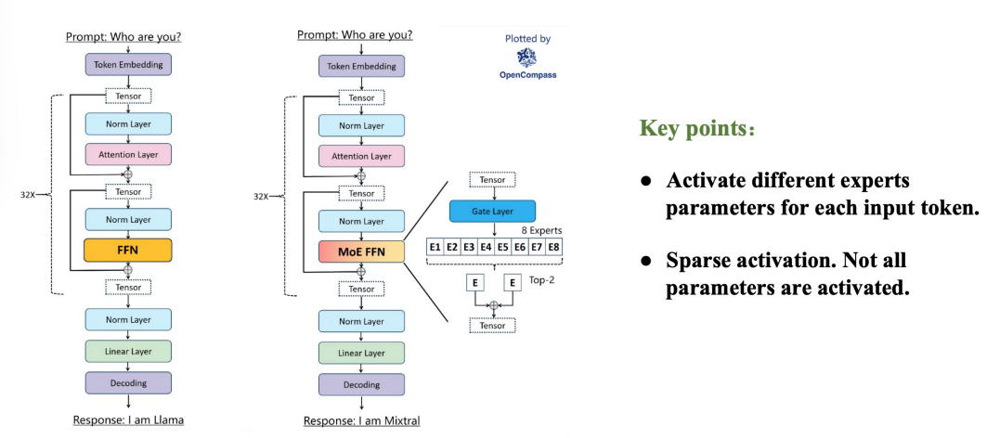

这几MoE的时候要关注什么（这里有些不太懂）：

- 网络类型是细粒度专家：64 专家、128专家等等
- 共享专家：独立专家
- 激活函数：RELU、GEGLU、SwiGLU
- MoE频率：每两层？每一层？
- 训练辅助损失：辅助损失、Z损失

这里讲一下细粒度和共享专家。第一个是传统的top2 routing，就是计算跟哪个专家最接近，然后由他们处理问题。第二个就是细粒度专家分割，在保持参数数量不变的情况下，让专家拆分变成1/m，但是变成m倍数量专家。这还增加激活专家的数量了，原本只激活一个大专家，现在要m个小专家。灵活组合也提升了，传统top2路由可能产生120种组合，细粒度可能由百万甚至更多，提升了模型对不同任务的适应能力。本段[来源](https://blog.csdn.net/weixin_41429382/article/details/144701936)。

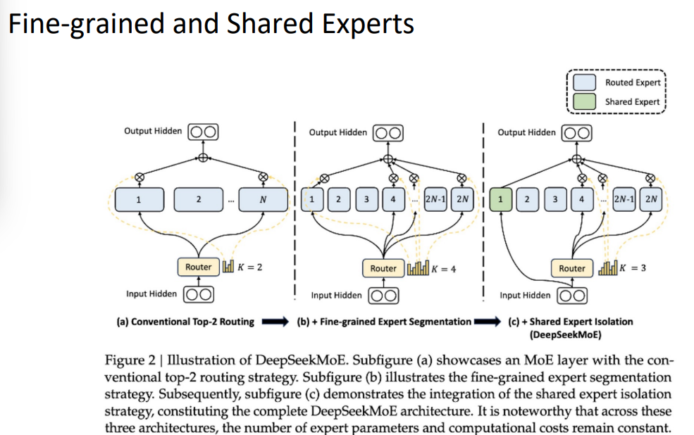

## 更有效率的注意力机制

第一个是原始的多头，QKV比是1：1：1，比较不划算，占大量内存。第二个是GQA，使用G个组可以减少储存每个头的键和值所需的内存开销，特别是具有大的上下文窗口或批次大小的情况下。总而言之，目的都是为了减少内存的消耗，减少参数体积，加快计算速度。最后一个是一种projection，有点像GAN那种latent representation通过decoder模型再变大的感觉。

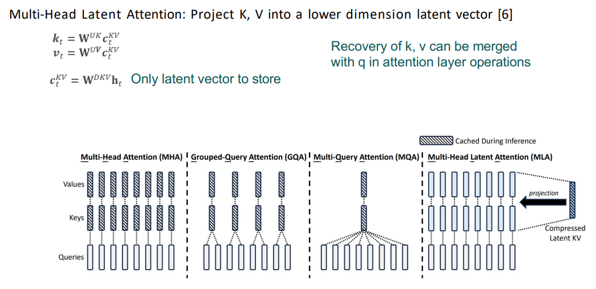

下面的图片展示了性能，可以看到MHA持续很高，但是GQA也能慢慢赶上，而且极大地加快生成速度。MQA的话就是所有Q都请求到一组KV上，速度很慢，但是也是能缓慢提高性能，并极大地节省空间。

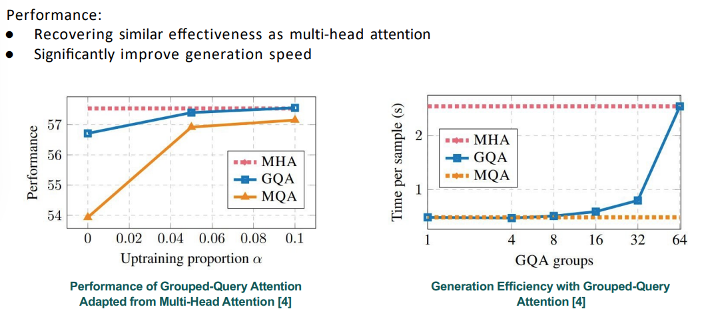

## LayerNorm改进

### Pre-Norm

原版Transformer的LayerNorm都是在残差相加之后的，gradient L2 norm持续在一个较大的值（下图显示在1.5以上）。一个改进方法就是把LayerNorm放到残差相加之前，甚至是多头注意力层和FFN之前，可以看到gradient L2 norm是可以缓慢下降的（降到0.2以下）。

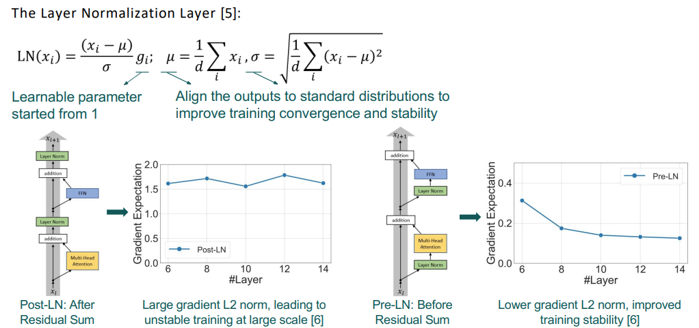

### RMSNorm

Root Mean Square Norm，在Norm的阶段只进行一个rescaling，不需要做recentering。总体效果跟LayerNorm是非常接近的，但是不同的点在于，它不再需要做recentering了，所以效率快了很多。

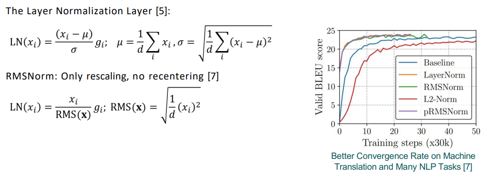

上面提到的这些，FFN，注意力，LayNorm的架构升级，都是可以适用于大多数近期公开的LLM产品的。

大多数的Transformer架构升级，都是为了效率和大规模学习的稳定性。简洁简便往往能获胜。

## Positional Encoding 改进

原版Transformer自己对位置并不了解，因为一下子看到了全部词，所以不知道哪个在前面哪个在后面。相比之下，CNN有locality prior，相近的数据会被一起处理，RNN有sequential prior，词是一个个被处理的。所以position encoding就是为了给Transformer加上位置信息。

### Absolute Position Information

其中一种绝对位置的方法就是，使用sinusoid位置嵌入，偶数的时候给一个sin函数，奇数的时候给一个cos函数。

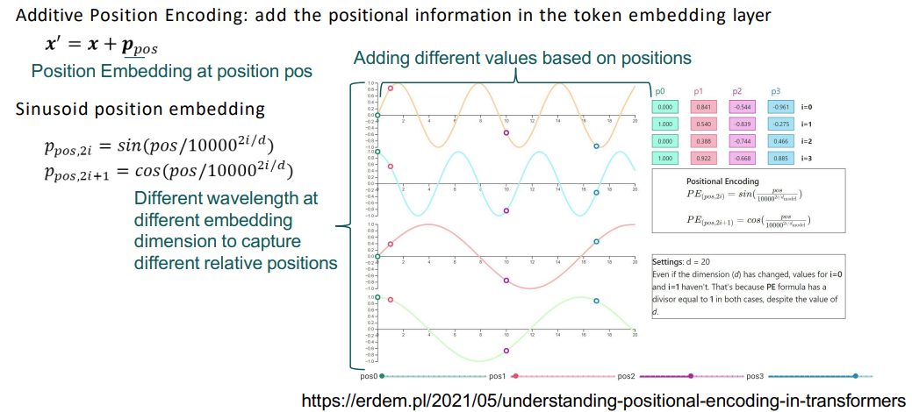

另一种绝对位置的方法就是做一个学习的embedding，使得每一个位置都有一个单独的embedding vector。这个和NLP学的，每一个word有一个学习来的vector是不一样的，这个是学了个位置，那个是学的每一个词在word space里。

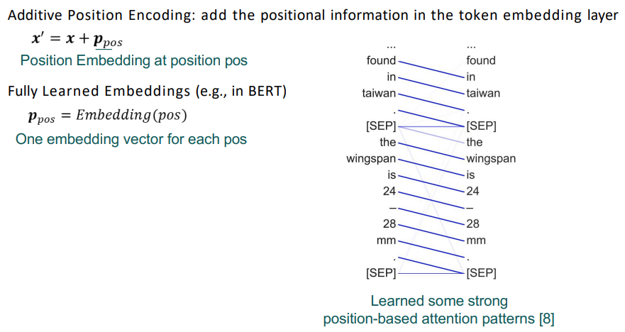

### Relative Position information

特性是Language prior，即语言中只有相对位置是重要的。在注意力机制中编码入相对位置信息可以使得准确率稍微提升。

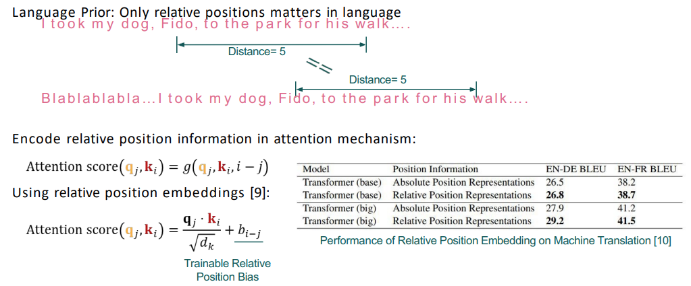

### Rotational position embedding

这个是模仿自注意力中，使用点乘计算相似度的做法，思考如何让这种旋转仅依赖于相对位置呢？

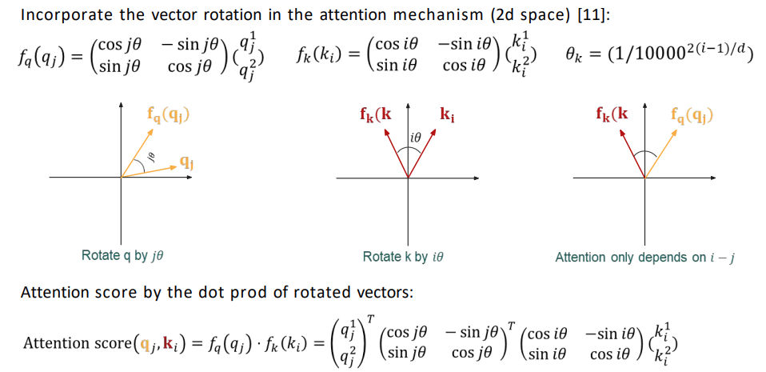

这个部分没怎么看懂，但是总得来说就是RoPE的效果比不使用rotary的效果更好。

然后上面的这些东西，FFN使用SwiGLU，Attention使用GQA，LayerNorm使用Pre-LayerNorm+RMSNorm，Position使用RoPE，加起来就是LLaMA-3模型。