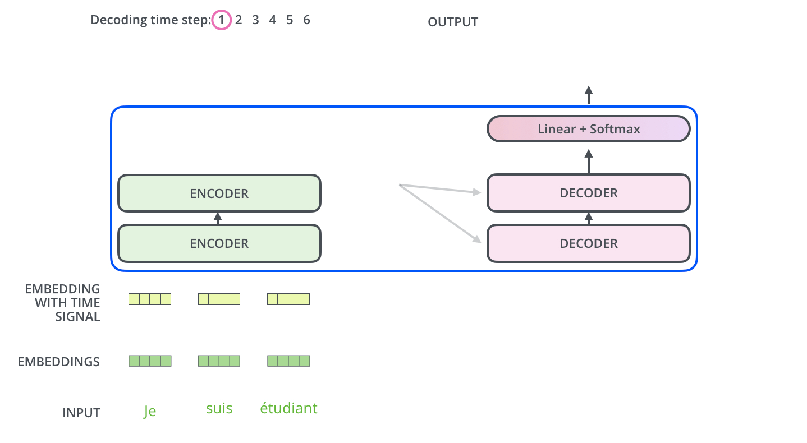
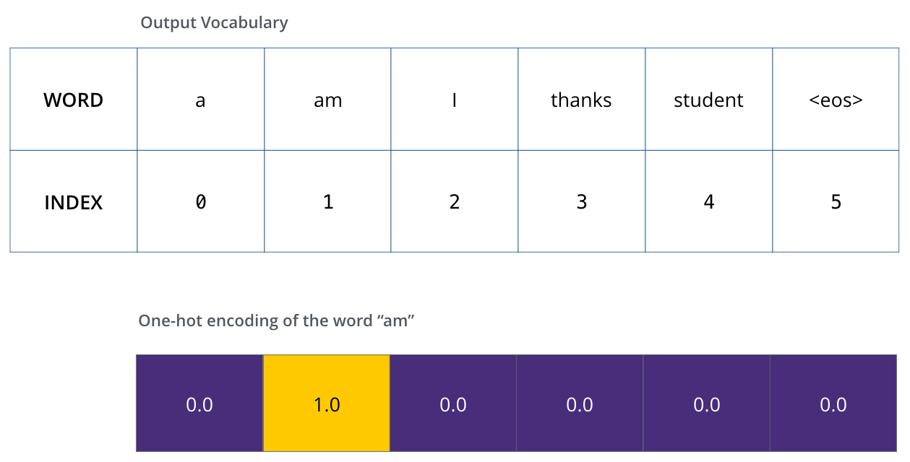
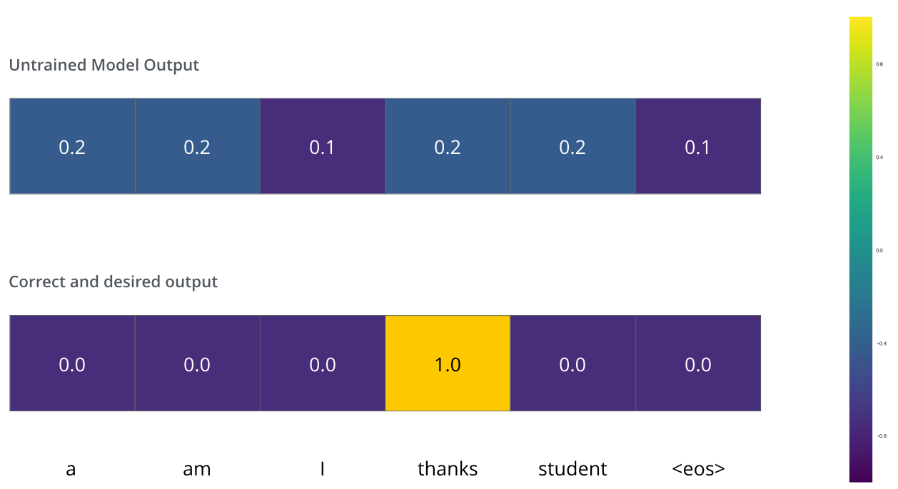
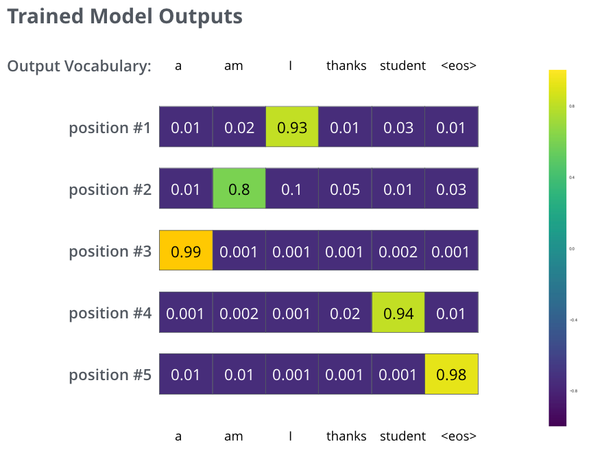

# The Illustrated Transformer (Note)

> 这是我读*Jay Alammar*的*The Illustrated Transformer*时的一些笔记。本科时我囫囵吞枣般学习了一下Transformer，但并没有深入学习。但近期，因为教授们都提到Transformer非常前沿非常重要，而且朋友告诉我其在CV上的效果甚至会比Deep Learning要好（出乎我的意料），因此我认为读一下这篇文章并深入学习一下Transformer的技术要点是有必要的，希望还不算太晚。

本人不拥有文中任何图片，如果侵权了请通知我删除。

## Architecture

我们可以从一个最简单的翻译功能来着手学习。下面这个图可以看出Transformer整体可以看成一个大函数大机器，输入A语言的句子，输出一个B语言的句子。

Transformer本体又由Encoders和Decoders组成。最初的输入会先进入Encoder，最终的输出从Decoder出来。Encoders们最终的输出又会给到Decoders们。

再次拆分，Encoders由多个Encoder组成，而Decoders们有着同样的数量。这里可以看到最后一个Encoder的输出是要传递给每一个Decoder来使用的。

### Encoder

每个Encoder的结构一模一样，但内部的权重不一样。每个Encoder由两个主要部分组成，分别是一个Self-Attention层和一个Feed Forward NN层。Self-Attention层让Encoder层在给某个输入编码时，同时看向其他的输入，后续有更详细的笔记。Feed Forward NN层则是一个MLP。

> 文中我并没有找到FFN的详细讲解，所以下面我对FFN的了解来自CSDN。FFN本质上是一个两层的MLP，数学本质是这样的：
>
> 
>
> 其中两层感知机中，第一层会将输入的向量升维，第二层将向量重新降维。这样子就可以学习到更加抽象的特征。（来自Odd Function的CSDN笔记）

这里顺便提一句Decoder，每个Decoder的结构都与Encoder很相似，但每个Decoder都多了一个Encoder-Decoder Attention层在中间。这个EDA层让Decoder专注于被输入句子中的相关部分。举个例子，当一个*them*出现时，是指代句子中提到的*cats*还是*dogs*就看它了。

### Tensors

Tensors就是Vectors，接下来是关于他们的作用，意义，以及他们是如何在整个Transformer里流转的。

简单来说，我们会把每个输入的词，通过一个词嵌入算法（Embedding algorithm），让他们都变成向量。在原论文中，每个向量的长度都是512，下面图片为了演示使用了长度为4的向量。

在最底层的encoder下面，才有这个词嵌入，其他的encoder的输入都是前一个encoder的输出。关于有多少个这样的向量，一般是最长的句子的尺寸。假如一个数据集中最长的句子有50个词，那么就有50个向量。

## Encoding

这里再提一次Encoder的整体结构，一个Encoder接收一个列表的向量作为输入，通过把他们放入SA层进行处理，然后再进入FFNN层处理（注意其实只有一个FFNN），最后把这个输出传给下一个Encoder。

### Self-Attention

Self-Attention的作用其实很简单，就是让每个词都能够通过观察其他词的位置来获取更多信息，让encoding效果更好。举个例子，<u>The animal didn't cross the street because it was too tired</u>，里面的it，人们都知道说的是The animal，电脑却不一定知道。因此，自注意力机制就帮我们更好地处理这个问题。

下面这个图片是最后一个encoder的Attention情况，可以看到it已经专注到The animal上面了。

### Self-Attention in Details

要计算self-attention的第一步，从encoder的输入向量中，创建三个向量，也就是q、k、v。具体来说，对于每个词，我们都要有一个Query向量、Key向量、Value向量。这些向量是由输入的向量和WQ、WK、WV权重使用矩阵乘法得出的，看下面的图。注意这些新向量比词嵌入向量小，图片中展示的3格来表示长度为64，别忘了4格是512。

先跳过QKV具体的意义，现在只需要知道这些对于计算attention有帮助就可以了。

计算self-attention的第二步就是计算一个score，这决定了每个词要对其他position有多少关注。比方说，我们已经通过第一步算出了所有词的qkv，我们就取q1和k1的点乘作为position1的第一个score，再取q1和k2的点乘作为position1第二个score。

第三步和第四步结合来看，就是计算他们的softmax，首先要使用每个score除以k向量长度的开根方，别忘了k长度为64，它长度的开根方就是8。最后我们把得到的position1的score1和score2进行softmax计算，得出概率。

第五步就是让softmax得出的概率直接乘以v。按照图中的例子，0.88先乘以v1，然后0.12乘以v2。这样的目的是让无关的词乘以一个很小的概率值，比如说0.001，确保他们被忽略。

第六步就是把得到的这些加权后的v向量们都加起来，得出z1，这就是position1这个词在self-attention层的输出了。其他的positions也是一样的计算。

### Matrix Calculation

上面已经完整地解释过self-attention的计算了，这里只是整合一下，其实我们可以使用简化后的公式直接计算到位。首先是QKV的计算，X都是一样的，只是分别和WQ、WK、WV做矩阵乘法。

下一步就是直接套公式，然后就可以得到Z矩阵了，非常快捷，不用像上面那样一个一个算每个Z。

### Multi-headed Attention

我们总说多头注意力机制，这里就讲一下，它是怎么提高表现的。首先，它增强了模型专注于不同位置的能力。比方说我们上面的这个Z，里面有一些别的词的encoding，但是主要包含它自己。看这个句子，"<u>The animal didn't cross the street because it was too tired</u>"，如果是多头的话，他就知道<u>it</u>到底是指哪个词了（这个例子上面讲过）。其次，multi-head给了attention layer多个"representation subspaces"，简单来说就是多组QKV权重。下面这图就是举例它有两个头。

现在假设我们每个self-attention有八个头，正如下面这个图。

但这也有一个问题，就是FFN层不需要这么多矩阵，FFN只要一个矩阵（每个词一个向量，组合成的一个矩阵）。为了解决这个问题，我们先把Z0到Z7都拼接起来，然后再乘以一个WO权重矩阵，这个矩阵会和整个模型一起训练。那我们就得到了一个Z，这个Z包含了所有注意力头的信息，我们把这个给FFN就可以了。

这里用一张大图总结，从左到右就是self-attention内数据的传递。

### Positional Encoding

上面没提这个，这里提一下，位置编码。简单来说，一个句子中有这么多词，怎么让机器知道他们的顺序呢？答案就是位置编码。方法也很简单，就是在输入嵌入时加一个vector。这些vectors会有一定规律，帮助模型确定每个词的位置，或者是记录了不同词之间的距离。

这里是一个例子，每个input vector长度只有4的例子，他们的positional encoding长度也只有4。把他们加起来，就可以给第一层encoder了。

原论文中的规律大概长这样，y轴是指第几个词，x轴是每个vector中的第几个index。

### Residuals

这里说说残差连接，residual connection。简单来说，就是有原先的X数据，直接连接到计算好的Z那里，然后进行相加和归一化。这个不仅在SA层有，FFN层也有。

我们把视角再拉远一点，这个其实在每个Encoder和Decoder里面都有，包括Decoder里面的Encoder-Decoder注意力层都有。

## Decoding

前面已经聊了很多Encoder了，那说明我们Decoder也已经掌握了一大部分了，因为他们非常相似。这里最后一个encoder会输出一个output list，这个output list会变成一组注意力向量：K和V，他们会被Decoder里面的encoder-decoder注意力层用到，作用是帮助decoder专注于输入序列中正确的位置。输出具体是如何变成K和V的没有提及，需要后续学习。

上面这个图展示了transformer生成第一个词，接下来要生成其他的词。上面生成了<u>I</u>，那么我们要把这个词也做个词嵌入，然后和positional encoding相加，输入给第一个decoder。并且不断把新生成的东西重复上面的步骤，再喂给第一个decoder，直到最后一个decoder生成了EOS，表示要中止生成。

这里说一下decoder的SA层和encoder的SA层有什么差别。Decoder中，SA层只被允许观察前面已经输出的sequence，使用的方法是在softmax进行计算前，遮挡未来的positions（把他们设置为-inf）。目的是防止decoder的自注意力访问未来的token。

Encoder-Decoder Attention层和多头自注意力层的运作方式是一样的，只有一点不同，那就是它会直接从下面的层中来创建Q矩阵，然后使用encoders那边输出的K和V。

## Final Linear and Softmax

从上面的图可以观察到，Decoder叠了这么多层，最后其实不会直接给出我们要的词，而是给出一个浮点数向量，这个向量通过一个全连接层和一个Softmax层，最终给出概率最高的词。

假设模型知道10000个不同的单词，那么全连接层后面紧接着的logits向量就会有10000格宽。然后他们再进入softmax计算，算出这一万个词的概率，产出一个10000格宽的log概率向量，选择其中最高概率的词。

## Training

在训练中，一个未经过训练的模型会通过一样的forward pass，但由于我们用着含有label的训练集，所以我们可以拿它和正确的输出做比较。

可视化一下，假设输出词典内只有六个单词，包含EOS，如下面这个图。

我们定义好输出词典后，我们就可以使用一个有着一样宽度的向量来表示每个词了，这个就叫独热编码。下面这个图就是<u>am</u>这个词的编码。

### The Loss Function

假设我们正在训练模型，我们的目标是让模型把<u>merci</u>翻译成<u>thanks</u>。这意味着我们要让输出变成<u>thanks</u>这个词的概率分布。但是由于模型还没怎么训练，翻译肯定会失败。看这个图，由于（Untrained）模型的参数是随机初始化的，模型就会给每个词以任意值生成一个概率分布。我们拿这个错误的概率分布和真实的概率分布进行比较，然后对模型的权重进行调整（采用反向传播）来使得这个output会更接近真实值。

问题来了，怎么比较两个概率分布呢？互相减就可以了，具体的话可以看一下[交叉熵](https://colah.github.io/posts/2015-09-Visual-Information/)和[KL divergence](https://www.countbayesie.com/blog/2017/5/9/kullback-leibler-divergence-explained)。举个翻译的例子，<u>je suis étudiant</u>变成<u>i am a student</u>。在这样一个有多个词的情况下，我们会想要模型连续地输出概率分布，是什么样的概率分布呢？

- 每个概率分布都有一个向量来代表（实际项目中长度可能高达30000或50000）
- 第一个概率分布在<u>I</u>这个词有最高的概率（这很明显）
- 第二个概率分布在<u>am</u>这个词有最高的概率分布（也很明显）
- 然后不断连续，直到第五个输出给出EOS符号。

这里我们先看一眼目标模型输出是什么样的。

在模型经过足够的训练后，我们会希望概率分布大概长这样：

由于我们一次只产生一个输出，我们可以让模型直接选择概率最高的那个选项，其他的直接丢掉，然后继续下一个位置，这个叫做贪心解码。另一种方法就是，不直接选择最高的概率，而是先保留最高概率的两个词，然后接下来跑两次模型，分别使用刚才的两个词，更少error的那个同时保留位置1和2。这个方法叫做beam search，在刚才说的这个例子里，beam_size是2，然后top_beams也是2（意味着返回两个翻译），这些都是超参数，可以手动调节。

> 个人对于KL divergence这篇没太看懂。

## Links

[The Illustrated Transformer by Jay Alammar](https://jalammar.github.io/illustrated-transformer/)

[从零开始了解transformer的机制|第四章：FFN层的作用 by Odd Function](https://blog.csdn.net/weixin_73179708/article/details/132516512)

